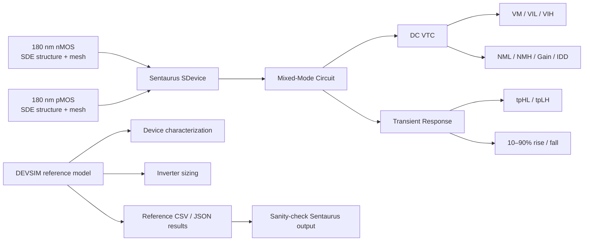
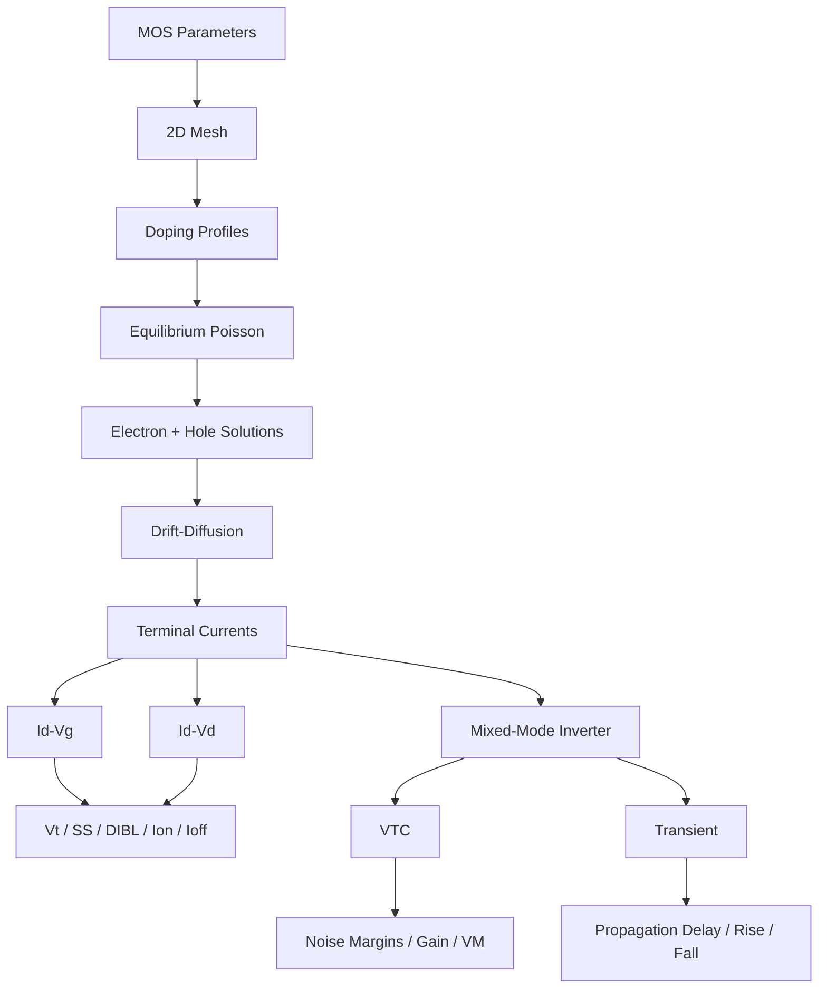
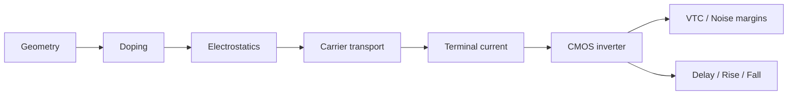
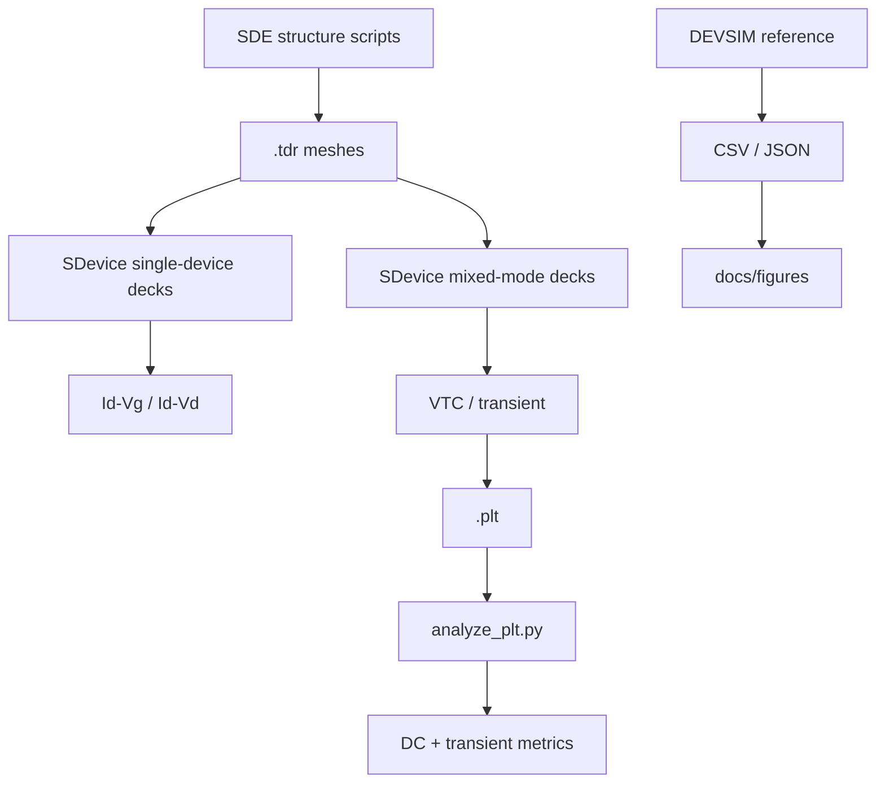

<div align="center">

<h1>Mixed-Mode CMOS Inverter — 180 nm TCAD</h1>

<p><strong>2D device-physics simulation of a 180 nm CMOS inverter using Sentaurus mixed-mode TCAD, with an open-source DEVSIM reference model.</strong></p>

<p>
  
  
  
  
  
</p>

<p>
  <a href="#architecture">Architecture</a> ·
  <a href="#device-design">Device Design</a> ·
  <a href="#physics-model">Physics Model</a> ·
  <a href="#results">Results</a> ·
  <a href="#sentaurus-flow">Sentaurus Flow</a> ·
  <a href="#devsim-reference-model">DEVSIM</a> ·
  <a href="#theory">Theory</a>
</p>

</div>

---

> **Academic project:** SDPS Lab (ECE 3144), MIT Manipal.  
> This repository is a TCAD/device-physics study, not a production semiconductor design kit or a calibrated process-design model.

## Overview

This project builds a **CMOS inverter from two physically simulated 2D MOSFETs** rather than representing the transistors with conventional SPICE compact models.

The flow contains:

1. **nMOS and pMOS 2D structures** generated with Sentaurus Structure Editor (SDE).
2. Explicit **doping profiles, contacts, oxide, spacers, gate material and mesh refinement**.
3. Drift-diffusion device simulation in Sentaurus SDevice.
4. A **mixed-mode circuit** in which the two TCAD devices are connected to the same inverter circuit.
5. DC analysis for the **voltage-transfer characteristic (VTC)**, switching point, noise margins, gain and supply current.
6. Transient analysis with a **10 fF load** for propagation delay and rise/fall time.
7. An independent **DEVSIM implementation** of the same device concepts and circuit used as an open-source reference and parameter-tuning environment.
8. Python tooling for extracting metrics from Sentaurus `.plt` output.

The important distinction is:

> **The inverter behavior comes from solving the semiconductor device equations on a mesh and coupling those devices to circuit equations.**

It is therefore useful as a bridge between **semiconductor device physics, CMOS circuit behavior and TCAD numerical simulation**.

---

## Architecture



### Mixed-mode concept

In a mixed-mode simulation, the transistors remain **full TCAD devices**, while SDevice additionally solves the circuit equations connecting their terminals.

Conceptually:

```text
             VDD
              │
        ┌─────┴─────┐
        │   pMOS    │
Vin ────┤   TCAD    ├──── Vout
        └─────┬─────┘
              │
        ┌─────┴─────┐
        │   nMOS    │
        │   TCAD    │
        └─────┬─────┘
              │
             GND

             │
             └── CL = 10 fF
```

The circuit solver and device solver are coupled rather than running a compact-model SPICE approximation of each transistor.

---

# Device Design

Both devices are based on the structure used in the lab's Exp 4/5 flow and are scaled to a **180 nm channel length**.

| Parameter | nMOS | pMOS |
|---|---:|---:|
| Channel length | 180 nm | 180 nm |
| Gate oxide | 4 nm SiO₂ | 4 nm SiO₂ |
| Gate material | TiN | TiN |
| Gate workfunction | 4.25 eV | 4.97 eV |
| Spacer | 100 nm Si₃N₄ | 100 nm Si₃N₄ |
| Body doping | Boron, 3 × 10¹⁷ cm⁻³ | Phosphorus, 3 × 10¹⁷ cm⁻³ |
| S/D dopant | Arsenic | Boron |
| S/D peak | 5 × 10¹⁹ cm⁻³ | 5 × 10¹⁹ cm⁻³ |
| S/D junction depth | 120 nm | 120 nm |
| LDD/extension peak | 5 × 10¹⁸ cm⁻³ | 5 × 10¹⁸ cm⁻³ |
| Extension junction depth | 35 nm | 35 nm |
| Lateral Gaussian factor | 0.8 | 0.8 |
| Width / AreaFactor | 1.0 µm | 1.5 µm |

The gate workfunctions are selected so that the reference model produces approximately:

```text
|Vtn| ≈ |Vtp| ≈ 0.42 V
```

The pMOS is made **1.5× wider** than the nMOS to compensate for its lower drive current and move the inverter switching point toward `VDD / 2`.

---

# Structure Generation

The Sentaurus Structure Editor scripts construct the transistor geometry and mesh.

### nMOS

```text
nMOS
├── Silicon body
├── SiO₂ gate oxide
├── TiN gate
├── Si₃N₄ spacers
├── Boron body doping
├── Arsenic source/drain Gaussian profiles
└── Arsenic extension/LDD profiles
```

### pMOS

```text
pMOS
├── Silicon body
├── SiO₂ gate oxide
├── TiN gate
├── Si₃N₄ spacers
├── Phosphorus body doping
├── Boron source/drain Gaussian profiles
└── Boron extension/LDD profiles
```

The SDE scripts also create:

- source contact
- drain contact
- gate contact
- body contact
- global mesh refinement
- fine channel/junction refinement
- oxide/silicon interface refinement

The channel region is intentionally meshed more finely because the electrical behavior is highly sensitive to the surface potential and doping gradients near the gate.

---

# Physics Model

## Sentaurus

The device decks solve coupled semiconductor equations using:

- Poisson equation
- electron continuity
- hole continuity
- drift-diffusion transport
- doping-dependent mobility
- high-field velocity saturation
- normal-field mobility effects
- SRH recombination
- temperature-dependent SRH behavior
- Slotboom effective intrinsic density / bandgap narrowing

The Sentaurus decks request quantities including:

- electron/hole density
- electron/hole current
- mobility
- velocity
- quasi-Fermi levels
- electric field
- potential
- space charge
- doping
- SRH generation/recombination
- bandgap
- affinity
- conduction and valence bands

This makes the simulation useful not only for obtaining terminal I–V curves but also for inspecting the internal device state.

---

# Open-Source DEVSIM Reference Model

Because Sentaurus is licensed software and is normally available only on the laboratory machines, the repository also contains a **from-scratch 2D drift-diffusion implementation using DEVSIM**.

The reference model reproduces the important device-level structure and physics:



### Numerical details

The DEVSIM implementation includes:

- equilibrium Poisson initialization
- Boltzmann carrier initialization
- electron/hole continuity
- SRH recombination
- doping-dependent mobility
- velocity saturation
- Scharfetter–Gummel current discretization
- explicit Bernoulli-function derivatives
- compensated summation for high-doping current calculations
- adaptive voltage ramping
- circuit-node coupling
- device width scaling

The model uses silicon material parameters and mobility/velocity parameters defined in `devsim/tcad.py`.

---

# Numerical Engineering

A particularly useful part of this repository is that it documents numerical problems encountered while implementing the open-source model.

Examples include:

### High-doping carrier initialization

At source/drain concentrations around:

```text
5 × 10¹⁹ cm⁻³
```

naive carrier expressions can suffer catastrophic cancellation.

The implementation instead uses an `asinh`-based formulation for equilibrium carrier concentrations.

### Doping-profile exponent handling

The DEVSIM expression parser required care around unary minus and exponent precedence. Expressions such as:

```text
exp(-(y/s)^2)
```

were rewritten explicitly to avoid parser ambiguity.

### Bernoulli derivatives

The Scharfetter–Gummel discretization requires derivatives of the Bernoulli function for Newton iterations.

The implementation therefore creates the Bernoulli terms as explicit edge models instead of relying on symbolic differentiation through an inline function.

### Cancellation in high-density current calculations

At high carrier concentrations, direct subtraction in the Scharfetter–Gummel current expression can lose relative precision.

The implementation uses a compensated three-term summation (`kahan3`) to reduce cancellation and improve Newton convergence.

These details are documented in:

```text
docs/devsim-notes.md
```

---

# Device Characterization

The repository characterizes both MOSFETs using:

## Transfer characteristics

`Id–Vg` is obtained at:

```text
|Vd| = 0.05 V
|Vd| = 1.8 V
```

This allows extraction of:

- threshold voltage
- subthreshold swing
- DIBL
- Ion
- Ioff
- Ion/Ioff

## Output characteristics

`Id–Vd` curves are generated for:

```text
|Vg| = 0.6 V
|Vg| = 0.9 V
|Vg| = 1.2 V
|Vg| = 1.5 V
|Vg| = 1.8 V
```

The resulting curves show the expected transition from the low-field/linear regime toward current saturation.

---

# Reference Results

The repository's checked-in numerical results are explicitly identified as **DEVSIM reference-model results**, not measured silicon and not claimed as completed Sentaurus results.

## Transistor metrics

| Metric | nMOS | pMOS |
|---|---:|---:|
| Vt, max-gm | 0.42 V | −0.42 V |
| Subthreshold swing | 75 mV/dec | 75 mV/dec |
| DIBL | 24 mV/V | 25 mV/V |
| Ion | 529 µA/µm | 362 µA/µm |
| Ioff | 9.6 pA/µm | 5.6 pA/µm |

These values come from:

```text
results/nmos_params.json
results/pmos_params.json
```

---

# CMOS Inverter DC Results

For:

```text
VDD = 1.8 V
Wn = 1.0 µm
Wp = 1.5 µm
```

the DEVSIM reference model reports:

| Metric | Result |
|---|---:|
| Switching point VM | 0.891 V |
| VIL | 0.750 V |
| VIH | 1.016 V |
| VOH | 1.652 V |
| VOL | 0.144 V |
| NML | 0.605 V |
| NMH | 0.636 V |
| Peak gain | 19.3 |
| Peak IDD | 118 µA |

The switching point is close to:

```text
VDD / 2 = 0.9 V
```

which is the intended effect of the 1.5× pMOS sizing.

---

# Sizing Study

The repository includes a pMOS-width sweep.

| Wp/Wn | VM | NML | NMH | Peak gain | Peak IDD |
|---:|---:|---:|---:|---:|---:|
| 1.0 | 0.828 V | 0.519 V | 0.734 V | 19.9 | 95 µA |
| **1.5** | **0.891 V** | **0.605 V** | **0.636 V** | 19.3 | 118 µA |
| 2.0 | 0.935 V | 0.672 V | 0.573 V | 20.8 | 136 µA |

### Interpretation

Increasing pMOS width strengthens the pull-up network:

```text
Wp ↑
  ↓
Pull-up current ↑
  ↓
VM shifts upward
```

Therefore:

- `Wp/Wn = 1.0` biases the switching point below `VDD/2`.
- `Wp/Wn = 1.5` gives a near-balanced inverter.
- `Wp/Wn = 2.0` moves the switching point above `VDD/2`.

The `1.5` ratio is therefore used for the primary inverter results.

---

# Transient Results

The reference transient simulation uses:

```text
VDD = 1.8 V
Wp = 1.5 µm
Wn = 1.0 µm
CL = 10 fF
```

The input pulse has:

```text
Delay       = 200 ps
Rise time   = 20 ps
Fall time   = 20 ps
High time   = 400 ps
Period      = 2 ns
```

Reference results:

| Metric | Result |
|---|---:|
| tpHL | 27.7 ps |
| tpLH | 27.2 ps |
| Average propagation delay | 27.5 ps |
| 10–90% fall time | 41.8 ps |
| 10–90% rise time | 43.6 ps |

The close agreement between `tpHL` and `tpLH` is consistent with the selected transistor sizing.

The transient output also shows small edge transients attributed in the project documentation to **Miller feedthrough through gate-drain capacitance**, which is naturally represented by the device-level simulation.

## Transient waveform


---

# Voltage Transfer Characteristic


The VTC demonstrates the three major CMOS inverter regions:

```text
Vin low       → pMOS ON, nMOS OFF  → Vout ≈ VOH
Transition    → both devices active → high gain
Vin high      → pMOS OFF, nMOS ON  → Vout ≈ VOL
```

The steep transition gives the inverter its noise immunity and digital switching behavior.

---

# MOSFET Transfer Characteristics


The transfer plots are generated from the DEVSIM reference results and show both:

- linear current scale
- logarithmic current scale

The logarithmic plot makes the subthreshold region and leakage behavior visible.

---

# Why Mixed-Mode TCAD?

A conventional SPICE simulation might represent each transistor using a compact model such as BSIM.

Here, the transistor is instead represented by:

```text
Geometry
   +
Doping
   +
Material properties
   +
Mesh
   +
Poisson equation
   +
Carrier continuity equations
   +
Mobility models
   +
Recombination
```

and then connected to a circuit.

That creates a direct chain:



This makes the project useful for studying how **device-level physics propagates into circuit-level behavior**.

---

# Sentaurus Simulation Flow

## 1. Generate the nMOS mesh

```bash
sde -e -l nmos_180.scm
```

Expected structure output:

```text
nmos_180_msh.tdr
```

## 2. Generate the pMOS mesh

```bash
sde -e -l pmos_180.scm
```

Expected structure output:

```text
pmos_180_msh.tdr
```

Inspect the structure and mesh with:

```bash
svisual nmos_180_msh.tdr
svisual pmos_180_msh.tdr
```

---

## 3. Optional single-device characterization

nMOS:

```bash
sdevice nmos_idvg_des.cmd
sdevice nmos_idvd_des.cmd
```

pMOS:

```bash
sdevice pmos_idvg_des.cmd
sdevice pmos_idvd_des.cmd
```

These decks generate the individual transistor transfer and output characteristics.

---

# Mixed-Mode Inverter Simulation

## DC

Run:

```bash
sdevice inverter_dc_des.cmd
```

The expected output is:

```text
inverter_dc_sys.plt
```

The DC deck sweeps:

```text
Vin = 0 → 1.8 V
```

while the pMOS and nMOS remain full TCAD devices.

The output can then be inspected using:

```bash
svisual inverter_dc_sys.plt
```

For the VTC:

```text
X = in OuterVoltage
Y = out OuterVoltage
```

---

## Transient

Run:

```bash
sdevice inverter_tran_des.cmd
```

The expected output is:

```text
inverter_tran_sys.plt
```

Inspect with:

```bash
svisual inverter_tran_sys.plt
```

The input should begin its first transition after the configured 200 ps delay.

---

# Automated Sentaurus Metric Extraction

The repository includes:

```text
sentaurus/analyze_plt.py
```

It reads the DF-ISE text `.plt` format and extracts inverter metrics without requiring NumPy.

### DC metrics

```bash
python3 analyze_plt.py dc inverter_dc_sys.plt
```

It reports:

```text
VM
VIL
VIH
VOH
VOL
NML
NMH
peak gain
peak supply current
```

### Transient metrics

```bash
python3 analyze_plt.py tran inverter_tran_sys.plt
```

It reports:

```text
tpHL
tpLH
average propagation delay
10–90% fall time
10–90% rise time
```

### Dataset inspection

```bash
python3 analyze_plt.py list inverter_dc_sys.plt
```

This is useful when Sentaurus changes or exposes dataset names differently from expected.

---

# DEVSIM Workflow

The open-source reference environment is organized into three main stages:

```text
characterize.py
      │
      ├── nMOS Id–Vg / Id–Vd
      └── pMOS Id–Vg / Id–Vd
               │
               ▼
         inverter.py
               │
        ┌──────┴──────┐
        ▼             ▼
       DC            TRAN
        │             │
        ▼             ▼
       VTC        propagation
                    delay
```

The repository's existing result files are generated from this reference flow.

The inverter CLI supports:

```bash
python devsim/inverter.py dc
python devsim/inverter.py tran
python devsim/inverter.py sizing
```

and accepts parameters including:

```text
--wn
--wp
--cl
```

For example:

```bash
python devsim/inverter.py dc --wn 1.0 --wp 1.5
```

and:

```bash
python devsim/inverter.py tran --wn 1.0 --wp 1.5 --cl 10e-15
```

---

# Design Automation

The DEVSIM model is not only a static reference. Its parameterized structure makes it possible to explore design choices programmatically.

Examples include:

- pMOS/nMOS width ratio
- gate workfunction
- channel length
- oxide thickness
- doping
- load capacitance
- operating voltage

The checked-in sizing study specifically explores:

```text
Wp/Wn = 1.0
Wp/Wn = 1.5
Wp/Wn = 2.0
```

and compares switching threshold, noise margins, gain and supply current.

---

# Results Pipeline



---

# Repository Structure

```text
mixed-mode-cmos-inverter/
│
├── README.md
├── LICENSE
├── .gitignore
│
├── sentaurus/
│   ├── nmos_180.scm
│   ├── pmos_180.scm
│   ├── nmos_idvg_des.cmd
│   ├── nmos_idvd_des.cmd
│   ├── pmos_idvg_des.cmd
│   ├── pmos_idvd_des.cmd
│   ├── inverter_dc_des.cmd
│   ├── inverter_tran_des.cmd
│   └── analyze_plt.py
│
├── devsim/
│   ├── tcad.py
│   ├── characterize.py
│   ├── inverter.py
│   └── plots.py
│
├── results/
│   ├── nmos_idvg.csv
│   ├── nmos_idvd.csv
│   ├── nmos_params.json
│   ├── pmos_idvg.csv
│   ├── pmos_idvd.csv
│   ├── pmos_params.json
│   ├── inverter_vtc_wp1.csv
│   ├── inverter_vtc_wp1.5.csv
│   ├── inverter_vtc_wp2.csv
│   ├── inverter_dc_wp1.json
│   ├── inverter_dc_wp1.5.json
│   ├── inverter_dc_wp2.json
│   ├── inverter_tran_wp1.5.csv
│   └── inverter_tran_wp1.5.json
│
└── docs/
    ├── THEORY.md
    ├── devsim-notes.md
    └── figures/
        ├── idvd.png
        ├── idvg.png
        ├── transient.png
        └── vtc.png
```

---

# Theory Guide

The repository contains a dedicated viva/theory document:

```text
docs/THEORY.md
```

It covers:

- what mixed-mode TCAD means
- CMOS inverter operation
- Poisson and continuity equations
- MOSFET operating regions
- voltage transfer characteristics
- noise margins
- switching threshold
- pMOS sizing
- propagation delay
- Miller capacitance/feedthrough
- device-vs-circuit simulation
- numerical considerations

This makes the repository useful as both a simulation project and a technical reference for explaining the implementation.

---

# Expected Sentaurus vs DEVSIM Differences

The DEVSIM model is intended as a **reference**, not as a claim that both simulators must produce identical numerical results.

The project documentation identifies several differences.

Sentaurus additionally includes effects such as:

- `Enormal` surface-normal-field mobility degradation
- Slotboom effective intrinsic density / bandgap narrowing

The reference documentation therefore expects Sentaurus results to differ quantitatively.

The project specifically anticipates:

- lower `Ion` in Sentaurus
- somewhat longer delays
- relatively similar inverter switching point and noise margins

because the latter depend strongly on the relative strength of the two devices.

### Sanity-check target

If the Sentaurus switching point is far outside approximately:

```text
0.85 V – 0.95 V
```

the first parameters to inspect are:

1. nMOS gate workfunction
2. pMOS gate workfunction
3. pMOS AreaFactor / width
4. source/body bias connections
5. doping profiles

The repository does **not** treat the DEVSIM values as experimentally calibrated silicon measurements.

---

# What This Project Demonstrates

### Semiconductor device physics

- MOSFET electrostatics
- doping profiles
- threshold voltage
- subthreshold behavior
- DIBL
- mobility degradation
- velocity saturation
- carrier transport
- SRH recombination

### TCAD

- Sentaurus Structure Editor
- Sentaurus Device
- SDevice mixed-mode
- device mesh generation
- mesh refinement
- `.tdr` / `.plt` workflows
- SVisual analysis

### CMOS circuit design

- CMOS inverter operation
- VTC
- switching threshold
- noise margins
- pMOS sizing
- supply current
- propagation delay
- rise/fall time
- capacitive loading

### Numerical methods

- nonlinear Newton solves
- adaptive bias stepping
- equilibrium initialization
- Scharfetter–Gummel discretization
- Bernoulli-function derivatives
- high-doping numerical stability
- compensated summation
- circuit/device equation coupling

### Engineering workflow

```text
Device structure
      ↓
Physics model
      ↓
Numerical convergence
      ↓
Single-device characterization
      ↓
CMOS sizing
      ↓
Mixed-mode circuit
      ↓
Automated metric extraction
      ↓
Reference-model comparison
```

---

# Limitations and Scope

This repository is intentionally scoped as an academic TCAD mini-project.

It does **not** claim:

- calibrated agreement with fabricated silicon
- process-corner characterization
- PVT analysis
- statistical mismatch analysis
- Monte Carlo variation
- FinFET/GAA behavior
- advanced short-channel models beyond the configured physics
- foundry-qualified compact-model extraction
- production SPICE model generation
- complete parasitic extraction
- physical layout-to-silicon validation

The DEVSIM results are also not a substitute for the Sentaurus simulation. They are an open reference implementation used to understand, tune and sanity-check the device/circuit behavior.

---

# Key Engineering Decisions

| Decision | Reason |
|---|---|
| 180 nm channel | Matches the project/lab target |
| 2D TCAD devices | Keeps device physics explicit while remaining computationally manageable |
| Mixed-mode SDevice | Couples physical MOSFETs directly to the inverter circuit |
| pMOS width = 1.5 µm | Balances the pull-up/pull-down strength |
| 10 fF load | Provides a concrete transient switching case |
| DEVSIM reference | Enables development and sanity checking without relying exclusively on licensed software |
| Automated `.plt` analysis | Converts TCAD output into reproducible inverter metrics |
| Checked-in CSV/JSON results | Makes reference behavior inspectable and reproducible |

---

# Reproducibility Checklist

Before considering a Sentaurus result comparable with the checked-in reference:

- [ ] Generate both SDE meshes.
- [ ] Verify the doping profiles visually in SVisual.
- [ ] Confirm nMOS/pMOS gate workfunctions.
- [ ] Confirm body and source connections.
- [ ] Confirm `VDD = 1.8 V`.
- [ ] Confirm `Wp/Wn = 1.5`.
- [ ] Run the single-device decks if required.
- [ ] Run the mixed-mode DC deck.
- [ ] Extract `VM`, `VIL`, `VIH`, `NML`, `NMH` and gain.
- [ ] Run the transient deck.
- [ ] Verify the 200 ps input transition.
- [ ] Extract `tpHL`, `tpLH`, rise time and fall time.
- [ ] Compare against the DEVSIM reference rather than expecting bit-for-bit numerical equality.

---

# References Inside the Repository

The most useful technical documents are:

```text
docs/THEORY.md
docs/devsim-notes.md
```

The implementation itself is also intentionally readable:

```text
sentaurus/*.scm
sentaurus/*_des.cmd
devsim/tcad.py
devsim/characterize.py
devsim/inverter.py
sentaurus/analyze_plt.py
```

---

# Final Summary

This project connects three levels of semiconductor engineering:

```text
┌─────────────────────────────────────────────┐
│              DEVICE PHYSICS                 │
│  Geometry · Doping · Poisson · Transport    │
└──────────────────────┬──────────────────────┘
                       │
                       ▼
┌─────────────────────────────────────────────┐
│                   TCAD                      │
│  Mesh · Newton Solve · Drift-Diffusion      │
│  Sentaurus / DEVSIM                         │
└──────────────────────┬──────────────────────┘
                       │
                       ▼
┌─────────────────────────────────────────────┐
│              CMOS CIRCUIT                   │
│  VTC · VM · Noise Margins · Gain            │
│  Delay · Rise/Fall · Supply Current         │
└─────────────────────────────────────────────┘
```

The main engineering idea is simple:

> **Do not treat the inverter as an abstract Boolean block. Build the transistors, solve their physics, connect their terminals to a circuit, and observe how device-level behavior becomes circuit-level behavior.**

<div align="center">

<strong>180 nm MOSFETs → Drift-Diffusion TCAD → Mixed-Mode CMOS Inverter</strong>

</div>
