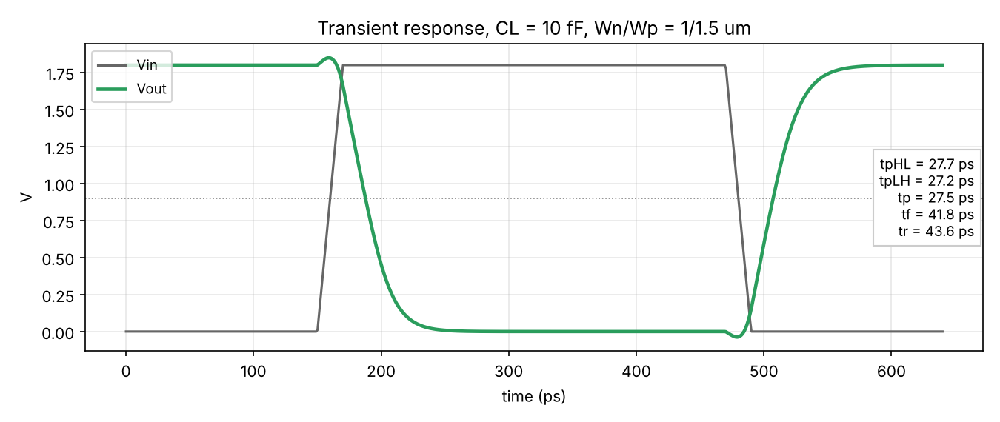
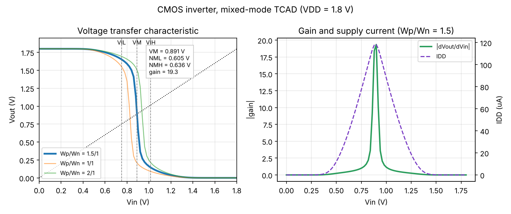
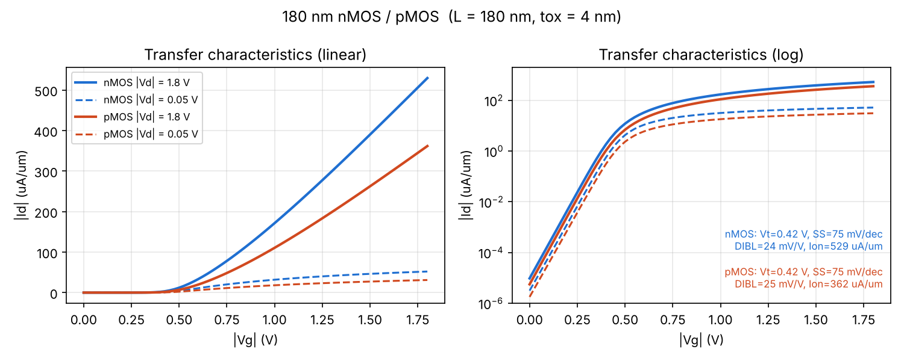

# Mixed-Mode CMOS Inverter: 180 nm nMOS + pMOS in Sentaurus TCAD

**SDPS Lab (ECE 3144) mini-project, MIT Manipal.** A CMOS inverter built from two **2D TCAD transistors (L = 180 nm)** and simulated in **mixed mode**: both devices are solved as full drift-diffusion structures while a circuit netlist connects them. The result is the inverter's VTC, noise margins, gain, supply current and switching delays, all derived from device physics rather than a SPICE model.

```
          VDD = 1.8 V
              │
          ┌───┴───┐  pMOS  W = 1.5 µm, L = 180 nm  (source, body = VDD)
  Vin ────┤       ├──────────── Vout ──┤├── CL = 10 fF (transient)
          └───┬───┘  nMOS  W = 1.0 µm, L = 180 nm  (source, body = 0)
              │
             GND
```

## What's in the repo

| Path | What it is |
|---|---|
| `sentaurus/nmos_180.scm`, `pmos_180.scm` | **SDE** structure scripts: regions, contacts, doping and mesh (same flow as Lab Exp 4/5) |
| `sentaurus/nmos_idvg_des.cmd`, `pmos_idvg_des.cmd` | **SDevice**: transfer curves at \|Vd\| = 0.05 V and 1.8 V |
| `sentaurus/nmos_idvd_des.cmd`, `pmos_idvd_des.cmd` | **SDevice**: output curves, \|Vg\| = 0.6 to 1.8 V |
| `sentaurus/inverter_dc_des.cmd` | **Mixed-mode DC**: VTC (Vin swept 0 to 1.8 V) |
| `sentaurus/inverter_tran_des.cmd` | **Mixed-mode transient**: pulse input, 10 fF load, delays |
| `sentaurus/analyze_plt.py` | Extracts VM, NML/NMH, gain, tpHL/tpLH from the SDevice `.plt` output |
| `devsim/` | Open-source reference model of the *same* devices and circuit (DEVSIM), used to tune parameters and predict results |
| `results/`, `docs/figures/` | Reference (predicted) curves and metrics |
| `docs/THEORY.md` | Inverter theory, mixed-mode concept, every design choice; viva prep |

## Device design

Both transistors use the Exp 4/5 structure, scaled to a 180 nm channel:

| Parameter | nMOS | pMOS |
|---|---|---|
| Channel length L | 180 nm | 180 nm |
| Gate oxide (SiO₂) | 4 nm | 4 nm |
| Gate | TiN, Φm = 4.25 eV | TiN, Φm = 4.97 eV |
| Spacers | Si₃N₄, 100 nm | Si₃N₄, 100 nm |
| Body doping | Boron 3×10¹⁷ cm⁻³ | Phosphorus 3×10¹⁷ cm⁻³ |
| S/D | Arsenic Gaussian, peak 5×10¹⁹, Xj = 120 nm | Boron Gaussian, peak 5×10¹⁹, Xj = 120 nm |
| Extensions (LDD) | Peak 5×10¹⁸, Xj = 35 nm | Peak 5×10¹⁸, Xj = 35 nm |
| Lateral diffusion | Gaussian, factor 0.8 | Gaussian, factor 0.8 |
| Width (AreaFactor) | 1.0 µm | 1.5 µm |

The gate workfunctions are chosen so that |Vtn| ≈ |Vtp| ≈ 0.42 V. The pMOS is 1.5× wider to make up for its lower drive current, which puts the switching threshold at VDD/2.

## Reference results (DEVSIM prediction)

These come from the open-source model of the identical structure. Use them to sanity-check your Sentaurus run; see *Expected differences* below.

**Transistors** (`results/*_params.json`)

| | nMOS | pMOS |
|---|---|---|
| Vt (max-gm) | 0.42 V | −0.42 V |
| Subthreshold swing | 75 mV/dec | 75 mV/dec |
| DIBL | 24 mV/V | 25 mV/V |
| Ion (\|Vg\| = \|Vd\| = 1.8 V) | 529 µA/µm | 362 µA/µm |
| Ioff | 9.6 pA/µm | 5.6 pA/µm |

**Inverter, DC** (`results/inverter_dc_wp1.5.json`)

| VM | VIL | VIH | VOH | VOL | NML | NMH | Peak gain | Peak IDD |
|---|---|---|---|---|---|---|---|---|
| 0.891 V | 0.750 V | 1.016 V | 1.652 V | 0.144 V | 0.605 V | 0.636 V | 19.3 | 118 µA |

**Sizing sweep** (`python devsim/inverter.py dc --wp <Wp>`)

| Wp/Wn | VM | NML | NMH | Peak gain | Peak IDD |
|---|---|---|---|---|---|
| 1.0 | 0.828 V | 0.519 V | 0.734 V | 19.9 | 95 µA |
| **1.5** | **0.891 V** | **0.605 V** | **0.636 V** | 19.3 | 118 µA |
| 2.0 | 0.935 V | 0.672 V | 0.573 V | 20.8 | 136 µA |

A wider pMOS strengthens the pull-up, so VM moves up. Wp/Wn = 1.5 puts VM closest to VDD/2 and balances the noise margins.

**Inverter, transient** (`results/inverter_tran_wp1.5.json`; 20 ps input edges, CL = 10 fF)

| tpHL | tpLH | tp (avg) | t_fall (10–90%) | t_rise (10–90%) |
|---|---|---|---|---|
| 27.7 ps | 27.2 ps | 27.5 ps | 41.8 ps | 43.6 ps |

tpHL ≈ tpLH confirms the Wp/Wn = 1.5 sizing is balanced. The small overshoot (and undershoot) of Vout at each input edge is **Miller feedthrough** through the gate-drain capacitance, captured directly by the device physics.






## Running it in Sentaurus (lab machine)

```bash
cd ~/STUDENTS/<reg-no>/inverter        # copy the sentaurus/ folder here
source setup-tcad.bashrc                # same as every lab session

# 1. structures (about 1 min each)
sde -e -l nmos_180.scm                  # -> nmos_180_msh.tdr
sde -e -l pmos_180.scm                  # -> pmos_180_msh.tdr
svisual nmos_180_msh.tdr &              # check doping and mesh

# 2. single-device checks (optional, about 5 min each)
sdevice nmos_idvg_des.cmd
sdevice pmos_idvg_des.cmd

# 3. mixed-mode inverter
sdevice inverter_dc_des.cmd             # VTC  -> inverter_dc_sys.plt
sdevice inverter_tran_des.cmd           # transient -> inverter_tran_sys.plt

# 4. metrics
python3 analyze_plt.py dc   inverter_dc_sys.plt
python3 analyze_plt.py tran inverter_tran_sys.plt
svisual inverter_dc_sys.plt &           # plot v(out) vs v(in)
```

**Plots in Svisual:** open `inverter_dc_sys.plt`, set X = `in OuterVoltage`, Y = `out OuterVoltage` for the VTC; add `vdd dd TotalCurrent` on Y2 for the supply-current peak. For the transient, plot `in` and `out` against `time`.

**Check before the transient run:** the input uses `pulse = (v_low v_high delay t_rise t_fall t_high period)` (SPICE order). Confirm this against `Vsource_pset` in the SDevice manual on the lab machine (`$STROOT/tcad/current/manuals`). After the run, `svisual inverter_tran_sys.plt` should show Vin rising at 200 ps.

**If something doesn't converge:** reduce `MaxStep` in the failing `Quasistationary`. If `find-edge-id` complains in SDE, the contact edge coordinates are in the `Contacts` section of the `.scm` and can be set from the GUI instead (Contacts > Set Edges), exactly as in the manual.

## Expected differences between Sentaurus and the reference

The reference model uses the same geometry, doping, workfunctions and the same core physics: drift-diffusion, doping-dependent mobility, velocity saturation, SRH. Sentaurus additionally applies **Enormal** (surface-roughness mobility degradation) and **Slotboom bandgap narrowing**, as in the manual's decks. Expect in Sentaurus:

- **Ion about 20–35% lower** (Enormal). Vt shifts only slightly.
- **Delays longer** by about the same fraction.
- **VM and noise margins nearly unchanged.** They depend on the *ratio* of nMOS and pMOS drive, and Enormal affects both devices similarly.

If your VM lands far from 0.85–0.95 V, check the workfunctions and AreaFactor first.

## Why there is an open-source model too

Sentaurus is licensed Synopsys software that only runs on the college machines. To make sure the decks would work and give sensible numbers *before* lab time, the same devices and circuit were rebuilt in [DEVSIM](https://devsim.org), an open-source TCAD with drift-diffusion and mixed-mode circuit support, and used to tune the workfunctions and pMOS width. `docs/devsim-notes.md` records the numerical issues solved along the way.

## Repo layout

```
sentaurus/   SDE + SDevice decks (the lab deliverable) and analyze_plt.py
devsim/      tcad.py (2D drift-diffusion MOSFET), characterize.py, inverter.py (mixed mode), plots.py
results/     CSV curves + JSON metrics from the reference model
docs/        THEORY.md, devsim-notes.md, figures/
```
